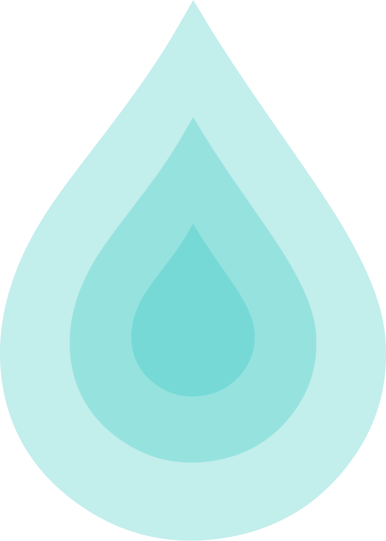

AquaFi Protocol
==============

Welcome! The purpose of the following pages are to provide a compresensive document specifiying all the different aspects of the AquaFi protocol and the Aqua token. If you are new to AquaFi you may want to check out the :doc:`./pages/category1/overview` or the :doc:`./pages/category1/faq`

**This documentation is aimed at those who want to learn the basics of AquaFi to those who want to learn the more in-depth technical aspects of the protocol too**

Getting Started
---------------

Explore the sidebar to find more specific documentation covering other
aspects of the protocol.

Developer links
---------------

The AquaFi codebase is comprised of an ecosystem of open source components. AquaFi follows a highly modular design which allows functionality to be swapped out without a token migration - you can read more about this on the :doc:`./pages/architecture`

- `Link 1 <https://github.com/BlockzeroLabs/1>`_
- `Link 2 <https://github.com/Blockzerolabs/2>`_

Contents
========

:ref:`Keyword Index <genindex>`, :ref:`Search Page <search>`

.. toctree::
   :maxdepth: 3
   :caption: Getting started

   ./pages/category1/overview.rst
   ./pages/category1/faq.rst

.. toctree::
   :maxdepth: 3
   :caption: The Protocol

   ./pages/category2/overview.rst
   ./pages/category2/architecture.rst
   ./pages/category2/layer2.rst

.. toctree::
   :maxdepth: 3
   :caption: The Token

   ./pages/category2/aqua-token.rst

.. toctree::
   :maxdepth: 3
   :caption: Security

   ./pages/security/testnet-competition.rst
   ./pages/security/bounty.rst
   ./pages/security/audit.rst

.. toctree::
   :maxdepth: 3
   :caption: Launch

   ./pages/category3/initial-distribution.rst
   ./pages/category3/kpi-options.rst
   ./pages/category3/charity.rst