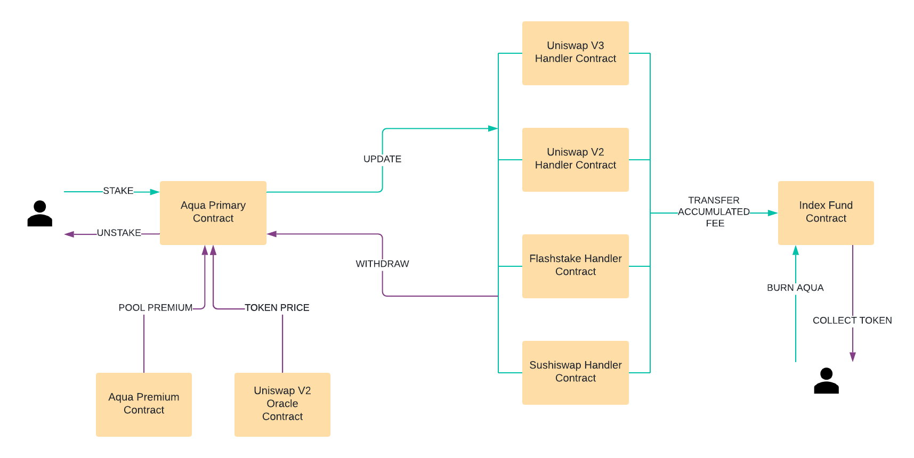

Architecture
============

Here at Blockzero Labs we have learnt a significant amount from the development process and architecture of the `Flash protocol <https://flashstake.io>`_
. This is why we decided to ensure AquaFi was designed in the most upgradable way possible from the beginning. It is due to this reason we followed a highly modular design for the protocol.

These modules can be upgraded/modified after the initial launch to extend or change the functionality. This is possible via governance and will require the Blockzero multi-sig wallet and a time delay to approve such a change - more information can be found on the governance section of this documentation.

The AquaFi protocol can be broken down into the following discrete pieces:

- Aqua Primary Contract: This module is responsible for bringing together the other modules of AquaFi. This contract specifies what handlers are allowed to interact with the Aqua Primary as well as additional functionality such as Stake, Unstake and Unstake all.
- Oracle Contract: This module is responsible for obtaining the price of the Aqua token in a decentralised manner. We currently have an implementation of this using time-weighed-average-price (TWAP) oracle from Uniswap Version 2. All pairs must have their pairs created with WETH in order for oracle to work.
- Handler Contracts: These "handler" contracts are responsible for supporting a specific decentralised exchange such as Uniswap V2. The purpose of this feature is to integrate the exchanges with aqua protocol upon launch, we intend to launch with the following handler contracts: Uniswap V2, Uniswap V3, Flashstake and Sushiswap.
- Index Fund Contract: This module is responsible for dispatching the tokens requested by the users against the aqua token they hold. It calculates the equivalent amount of tokens to be dispatched on the basis of the aqua token percentage they provide. After transferring the tokens, this contract burns the aqua token of that user thus decreasing the aqua total supply and increasing the value of the token. The contract acquires 2% of the tokens in every unstake.
- Timelock Contract: The sole purpose of this contract is to provide time-lock functionality on selected functions. This is the contract which "owns" or can execute the "admin" functionality. The Blockzero council multi-sig will be the proposer and executor
- Premium Contract: This contract is responsible for calutating the premium on fees earned by the user while unstaking. All of the logic for calculating premium resides in this contract.

**Aqua Primary Contract**
=========================
The primary contract consists of some generalized components that ensures the integration with different exchanges like Uniswap V2, Uniswap V3, Sushiswap and others.

**Stake**
---------

Parameters: (uint256 tokenIdOrAmount, address handlerAddress, address contractAddress, bytes data)

Description: This function is responsible for staking the users lp token and transfer it to handler contract. It updates the stakes record and invokes the handlers update function where it checks for validation checks & stores the lp token data. 

**Unstake**
-----------

Parameters: (bytes32[] calldata id, uint256[] calldata tokenValue)

Description: This function is responsible for unstaking the lp tokens. It iterates through the list of lp tokens and calculates the cumulative fees in aqua token from all the lp tokens. This function fetches the fees by calling the internal function _unstake in which which expects single id and tokenValue and returns the aqua amount in terms of fees accumulated for that token. Inside the function it fetches the token difference, aqua premium and token address by calling the withdraw function of the selected handler. Then on the basis of aqua price fetched from the oracle, it calculates the aqua amount which is then added to the fees calculated on the basis of aqua premium. It also mints addtitional 20% of Aqua tokens and sends it to the indexfund contract.

**Oracle Contract**
===================

This contract is responsible for fetching the price of a provided token address with respect to aqua token. It only works for pair who has pair with WETH.

**Fetch**
---------
Parameters: (address token, bytes32 data)

Description: This function is responsible for fetching the amount of aqua per token provided.

**FetchAquaPrice**
------------------
Prameters: (no params)

Description: This function retrieves aqua price in terms of eth i.e one Eth is equal to X Aqua.

**Handler Contract**
====================

There are different handler contracts specific to the exchanges and their respective logic, each handler contract makes sure the interaction with aqua primary contract and allow only aqua primary contract to access its functions to perform the aqua protocol specific operations.

- Handlers with ERC20 lp tokens (Uniswap v2, Sushiswap, Flashstake etc)

- Handlers with ERC721 lp tokens "nfts" (Uniswap V3)

**V2 Handler Functions**
------------------------
The major v2 handler functions are as follows.

**Update**
----------

Parameters: (bytes32 stakeId,uint256 lpAmount,address lpToken,bytes calldata data)

Description: It stores the rootk (K = root(token0 * token1)) against the lpToken that has been staked. It is only callable by the primary contract. It decodes the staker and pool address from the encoded data param. If the pool is whitelisted and the stake does not already exists then it finds the rootK value of the lpToken and saves the required stake data in the mapping.

**Withdraw**
------------

Parameters: (bytes32 id, uint256 tokenIdOrAmount, address contractAddress)

Description: Calculates the rootK difference to see if any fees has been accumulated. If so, it only pays the lp amount back to the user and returns fees in token0 & token1 back to aqua primary contract from where aqua gets paid out. Indexfund receives lp token. It is only callable by the primary contract, it returns tokenAddress, premium, tokenDifference and encoded data of premium, tokenAddress and tokenFess accumulated. Once it is done then it deletes the stake entry from the storage.

**V3 Handler Functions**
========================

The major v3 handler functions are as follows.

**Update**
----------

Parameters: (bytes32 id, uint256 tokenValue, address contractAddress, bytes32 data)

Description: It checks the fees against the nft, if the fees exists then it updates the fees in the user stakes record. It does so by first decoding the pool address from the encoded data received from the params. It checks if the pool is whitelisted if yes then it updates the token0AtDeposit and token1AtDeposit by fetching it from nftPositionManager positions on the basis of tokenValue received in the params. This function is only callable from Aqua Primary Contract.

**Withdraw**
------------

Parameters: (bytes32 id, uint256 tokenIdOrAmount, address staker, address contractAddress)

Description: This function performs validation checks & then sends the lp tokens back to the staker. It also tarnsafers the fees accumulated in token0 and token1  to indexfund. It returns the amount of fees in token0 & token1 back to aqua primaty contract from where aqua token gets paid out with premium.

**Admin Functions**
===================

The functions specified below are only callable by the owner address. The owner address for these functions is a timelock contract controlled by the Blockzero council. These functions are available in all of the handler contracts.

The timelock contract enforces a waiting period after a proposed change has been suggested.

**AddPools**
------------

Parameters: (address[] calldata tokenA, address[] calldata tokenB, uint256[] calldata aquaPremium, uint24[] calldata fee)

Description: This is an owner modified function (only callable by owner). It expects the lists of token addressees, list premium of the pairs and their corresponding fee values. It's purpose is to whitelist the pools in the handlers.

**UpdateIndexFundAddress**
--------------------------

Parameters: (address newAddr)

Description: This is a owner modified function (only callable by owner). It expects the new index fund address. It is used to update/change the index fund contract address to be used in the handler.

**UpdatePremiumOfpool**
-----------------------

Parameters: (address pool, uint256 newAquaPremium)

Description: This is a owner modified function (only callable by owner). It expects the pool address and its corresponding new aqua premium value. It is used to update the aqua premium value of the whitelisted pools in the handler.

**UpdatePrimary**
-----------------

Parameters: (address newAddress)

Description: This is a owner modified function (only callable by owner). It expects the new address of the primary contract. It simply updates the aquaPrimary contract address in the handler.

**UpdatePoolStatus**
--------------------

Parameters: (address pool)

Description: This is a owner modified function (only callable by owner). It expects the address of a pool for which the status in the pool whitelist has to be changed.
