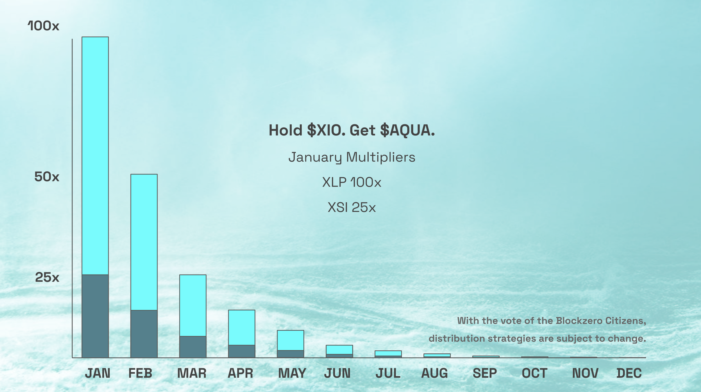

Distribution
============

This page will briefly discuss the initial token allocation and distribution of the Aqua token.

Eligibility
-----------
The AquaFi protocol and the corresponding Aqua token was developed by Blockzero Labs as part of the token studio model.

It was stated in December of 2020 that all XIO holders would recieve free Aqua tokens upon launch. Since this date, XIO holders have been earning the rights to Aqua tokens on a daily basis as per the image circulated below:

XIO holders were eligible to Aqua tokens so long as they held XIO tokens from December 2020 to December 2021.

This has since changed as per `this governance vote <https://vote.blockzerolabs.io/#/blockzerolabs.eth/proposal/QmXJpiB9bx8G7TzhEgCd6EqnA694gBbSppHVvRGjAPJxM4>`_ due to complications introduced during development which you can find out about `here <https://vote.blockzerolabs.io/#/blockzerolabs.eth/proposal/QmXJpiB9bx8G7TzhEgCd6EqnA694gBbSppHVvRGjAPJxM4>`_
.

**The eligibility of Aqua tokens will run up until the launch of AquaFi. Once the protocol launches, XIO holders will no longer be earning Aqua tokens over time (as per the model illustrated above)**

As mentioned in the governance vote, we will determine a rough estimate of Aqua based on current projections (if eligility continued until December). These tokens will be minted and placed into the Vortex where citizens will be able to earn them by staking XIO. This effectively stopped all future eligibility and allows earning of Aqua based on staked XIO in the Vortex.

Allocation
----------

Initially it was decided that all the Aqua tokens in existence would be allocated to XIO holders. This was announced in December of 2020 as part of the Christmas announcement.

The token allocation has since changed through governance votes which were all approved by the community:

- `What percentage of Aqua tokens would you want to see in the Blockzero Vortex? <https://vote.blockzerolabs.io/#/blockzerolabs.eth/proposal/QmVsFPB3PxPH8Xsr4iSghjyRZpXDkuPG2iRtPycV1rzTm4>`_ (result: 41%)
- `How many % of the Vortex Aqua tokens should be kept in orbit 1 (treasury) for Aqua KPI Options and other marketing purposes? <https://vote.blockzerolabs.io/#/blockzerolabs.eth/proposal/QmX6JcmDkHtLNmYYYRkWPxFh4F7UpH3M3ariVNFcEMffgF>`_ (result was overturned by below vote)
- `Should 20% of the total Aqua supply be allocated to KPI Options as mentioned below and 21% be allocated to the Vortex Treasury? <https://vote.blockzerolabs.io/#/blockzerolabs.eth/proposal/QmZZ7rB1fxd2ydQm3f8rdLFhGXqx3Ux2K5WYQaxmC6Ah9g>`_ (result: yes)

Due to the above governance votes, the token allocation will be as follows:

- 21% to Vortex Treasury
- 20% to KPI Options (you can read more in the appropriate section of this documentation)
- 59% to XIO Token holders who earned Aqua

We estimate the total token supply to be somewhere around 700-900 million.

Distribution
------------

The distribution of tokens to the XIO token holders who earned Aqua will take place through Dropzero. This means upon launch, we will upload a CSV file with all the earned tokens and mint these number of tokens before placing them directly into Dropzero. Once these tokens are placed into Dropzero, these tokens will be claimable by all participants.